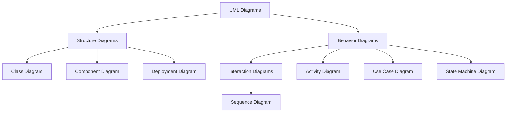

# Vacation Tracking System (VTS) — Project Specification

## 1. Vision & Goal

**Vision:** To empower employees with independence in managing their time off while significantly streamlining organizational efficiency.
**Goal:** To create a centralized, automated system that manages employment agreements and leave requests, thereby reducing the administrative time, cost, and complexity associated with manual tracking.

## 2. Purpose (Why do we need it?)

**The Problem:** Currently, vacation management is a manual, slow process requiring multiple levels of approval (Immediate Manager → HR Clerk). This process causes delays, wastes HR resources, and lacks transparency for employees.
**The Solution:** The VTS will automate the workflow, enforce policy rules instantly, and limit human intervention to at most one approval step. This saves money for the HR department and improves the internal business process.

## 3. What is it?

The VTS is a web-based application (implemented as an extension to the existing intranet portal) that allows employees to request, track, and manage vacation, sick leave, and personal time off. It acts as an intelligent layer between the users and the legacy HR data.

---

## 4. Domain

* **Context:** Organizational management of employee time off (Vacation, Sick Leave, Personal Leave).
* **Current State:** Manual process requiring Manager approval followed by HR Clerk verification.
* **Future State:** Automated validation based on employment rules. Manager approval is optional (role-dependent), and HR intervention is removed from the standard flow.

---

## 5. Actors

Entities that interact with the system:

* **Employee (Worker):** The primary user managing their own leave.
* **Manager:** Approves requests and can award personal leave.
* **HR Personnel (Clerk):** Oversees the system and handles overrides.
* **System Administrator:** Manages system configuration and logs.
* **HR Legacy System:** The external database source for employee data.
* **Email Server:** Handles sending notifications.

---

## 6. Functional Requirements

Defines what the system must **do**:

### A. Leave Management & Rules

* The system shall allow employees to submit requests for vacation, sick leave, and personal time off.
* The system shall validate requests using flexible, rule-based logic (checking employment agreements) without requiring the user to know the specific policies.
* The system shall allow employees to view past requests (previous calendar year) and submit future requests (up to 18 months ahead).

### B. Approval Workflow

* The system shall automate the approval process, requiring **at most one** manual approval (from the Immediate Manager).
* The system shall support "optional" manager approval (some high-level employees may have auto-approval).
* The system shall allow managers to directly award personal leave time to employees (within system-set limits).

### C. Administration & Overrides

* The system shall allow HR and Admins to override validation rules/restrictions.
* The system shall strictly log all override actions for audit purposes.

### D. Integration & Notifications

* The system shall send email notifications to managers for pending approvals and to employees for status updates.
* The system must provide a Web Service interface for other internal systems to query employee vacation summaries.

---

## 7. Non-Functional Requirements

Defines **how** the system performs:

* **Usability:** The interface must be user-friendly and require minimal training.
* **Efficiency:** The system must significantly reduce the time required to process requests compared to the manual workflow.
* **Auditability:** The system must keep a detailed activity log of *all* transactions and state changes.
* **Security & Authentication:** The system must use the existing intranet portal’s Single Sign-On (SSO) mechanisms for user authentication and role management.

---

## 8. Constraints

System limitations and boundaries:

* **Hardware:** Must utilize existing hardware and middleware infrastructure.
* **Integration:** Must interface with the existing **HR Legacy System** to retrieve and update employee information.
* **Platform:** Must be implemented as an extension/module of the existing company **Intranet Portal**.

---
# UML Diagrams Used



---

### 1. VTS_UseCaseDiagram
This diagram defines the **scope** of the VTS. It shows *who* (the actors) can do *what* (the use cases) within the system. It captures the high-level functional requirements.

**Key modeling decisions based spec:**

- **System Boundary:** Everything happens within the "Vacation Tracking System".
- **External Systems:** HR Legacy System and Email Server are secondary actors on the right side.
- **Include Relationships:** Every time a request is submitted or validated, the system *must* interact with the HR Legacy System to get data. This is an `<<include>>`.
- **Extend Relationships:** Notifications happen conditionally based on the outcome of other use cases (submitting, approving, rejecting). This is an `<<extend>>`.


---

### 2. VTS Activity Diagram (Swimlane Workflow)

**Purpose:** This diagram details the **workflow** of the most critical process: **"Leave Request Submission and Approval"**. It uses "swimlanes" to show exactly who is responsible for each step, highlighting the automation and the "at most one manual approval" constraint.

**Key modeling decisions based on your spec:**

- **Swimlanes:** Separated into Employee, VTS (System), and Manager to show responsibilities clearly.
- **Rule Validation:** The first major decision diamond happens entirely in the system lane.
- **The "Optional Approval" Constraint:** The critical decision node `if (Requires Manager Approval?)` implements the requirement that some high-level employees might bypass approval, ensuring the "at most one manual approval" rule is met.


---
### 3. VTS Flow Chart

**Purpose:** While very similar to an Activity Diagram, a Flow Chart is often simpler and used to communicate the pure logic flow to non-technical stakeholders without the complexity of swimlanes or parallel processing symbols. It focuses just on the "steps and decisions".


---
### 4. VTS Leave Request Workflow (Pseudocode)
```
PROCEDURE Process_Leave_Request(EmployeeID, RequestDetails)
    // --- 1. System Initialization and Data Retrieval ---

    RequestID = GENERATE_UNIQUE_ID()
    RequestDetails.Status = "Submitted"
    CALL Log_Transaction(RequestID, EmployeeID, "Request Submission")

    // Retrieve external employee information (Constraint: Interface with HR Legacy System)
    EmployeeData = CALL Get_Employee_Data_From_Legacy_System(EmployeeID)
    
    IF EmployeeData IS NULL THEN
        RequestDetails.Status = "Failed"
        CALL Log_Transaction(RequestID, "System", "Failed to retrieve employee data.")
        CALL Send_Email(EmployeeID, "Request Failed", "Contact HR.")
        RETURN
    END IF

    // --- 2. Automated Rule Validation ---

    ValidationResult = CALL Validate_Request_Rules(EmployeeData, RequestDetails)

    IF ValidationResult.IsValid IS FALSE THEN
        // Path A: Auto-Rejected by Rules
        RequestDetails.Status = "Rejected"
        RequestDetails.RejectionReason = ValidationResult.Reason
        CALL Log_Transaction(RequestID, "System", "Auto-Rejected by VTS Rules.")
        CALL Send_Email(EmployeeID, "Request Rejected", RequestDetails)
        
        // No further action needed for rejected request
        RETURN
    END IF

    // --- 3. Determine Approval Path (Enforcing "At Most One Manual Approval") ---

    IF EmployeeData.Role REQUIRES_MANAGER_APPROVAL IS FALSE THEN
        // Path B: Auto-Approval for High-Level Employees
        RequestDetails.Status = "Approved"
        CALL Log_Transaction(RequestID, "System", "Auto-Approved due to role.")
    ELSE
        // Path C: Manual Manager Approval Required
        ManagerID = EmployeeData.ImmediateManagerID
        RequestDetails.Status = "Pending Manager Approval"
        CALL Log_Transaction(RequestID, "System", "Pending Manager Approval.")
        
        // Send notification to trigger manual approval process
        CALL Send_Email(ManagerID, "Action Required: New Leave Request", RequestDetails)

        // Wait for Manager Decision (Simulate event/API webhook trigger)
        ManagerDecision = CALL Wait_For_Manager_Decision(RequestID)

        IF ManagerDecision.Action IS "Approved" THEN
            RequestDetails.Status = "Approved"
            CALL Log_Transaction(RequestID, ManagerID, "Manually Approved by Manager.")
        ELSE IF ManagerDecision.Action IS "Rejected" THEN
            RequestDetails.Status = "Rejected"
            RequestDetails.RejectionReason = ManagerDecision.Reason
            CALL Log_Transaction(RequestID, ManagerID, "Manually Rejected by Manager.")
        ELSE
            // Timeout or unexpected action: keep pending or escalate
            RequestDetails.Status = "Pending (Escalated)"
            CALL Log_Transaction(RequestID, "System", "Manager decision timeout/error.")
            RETURN // Stop process until decision is made
        END IF
    END IF

    // --- 4. Finalization and Notification (Merge Point) ---

    IF RequestDetails.Status IS "Approved" THEN
        // Update employee leave balances in external system
        CALL Update_Legacy_System_Records(RequestID, RequestDetails.Duration)
        CALL Log_Transaction(RequestID, "System", "Legacy System Updated (Approved).")
        CALL Send_Email(EmployeeID, "Request Approved", RequestDetails)
    ELSE IF RequestDetails.Status IS "Rejected" THEN
        // Send final rejection notification
        CALL Send_Email(EmployeeID, "Request Rejected", RequestDetails)
    END IF

END PROCEDURE
```
---
### 5. VTS_Leave_Request_State_Machine

This diagram clearly shows the five possible end states for a request: Approved, Rejected_VTS, Rejected_Manager, Failed, and PendingEscalated.


---
### 6. VTS Sequence Diagram

**Purpose:** This diagram details the chronological interaction of objects for the primary scenario: **"Employee submits a request that requires Manager approval."**


It showcases the interactions between the Employee, the VTS System, the Legacy Database, the Email Server, and the Manager.

---

### 7. Deployment Diagram

**Purpose:** This diagram maps the software components to the physical hardware/infrastructure.

**Key constraints addressed:**

- **"Extension to existing intranet portal":** The VTS Module is nested inside the Intranet Portal component.
- **"Interface with HR legacy systems":** Shows the connection to the Legacy Mainframe/DB.
- **"Use existing hardware":** Shows standard Server and Client nodes.


---
### 8. VTS Component Diagram

**Purpose:** This diagram shows the structural relationships between the software components. It highlights how the VTS module is broken down into logical parts (Rules Engine, Controller, Legacy Adapter) and how they wire together via interfaces.

**Key Design Decisions:**

- **Rules Engine:** Separated into its own component to satisfy the requirement for "flexible, rule-based logic."
- **Legacy Adapter:** An "adapter" pattern is used to isolate the modern VTS from the specific technical details of the old "HR Legacy System."
- **External Query API:** Represents the requirement for a "Web service interface for internal systems."

